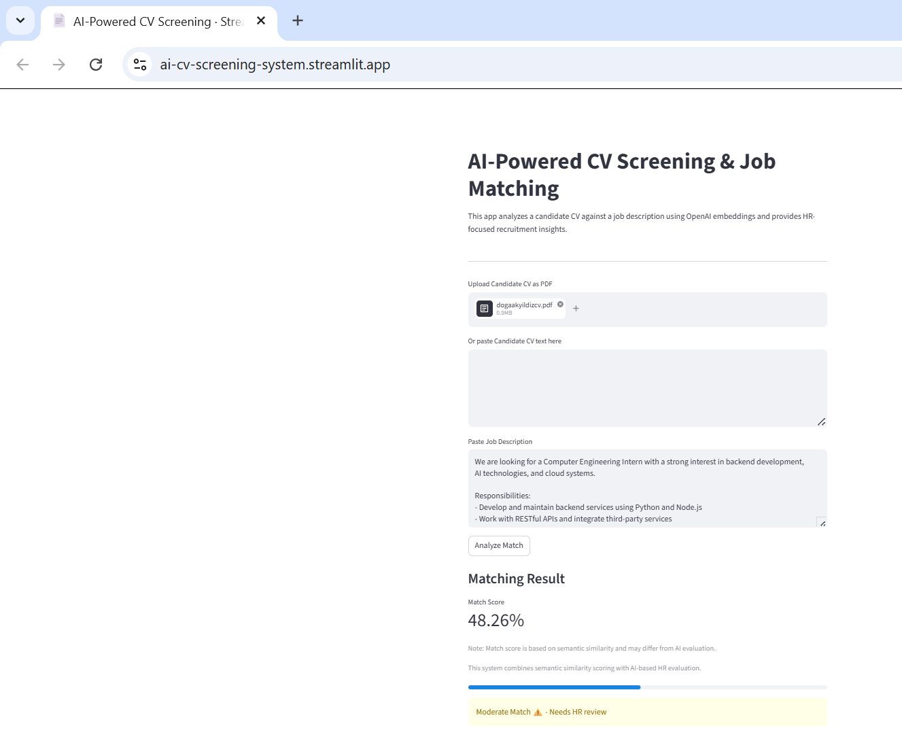
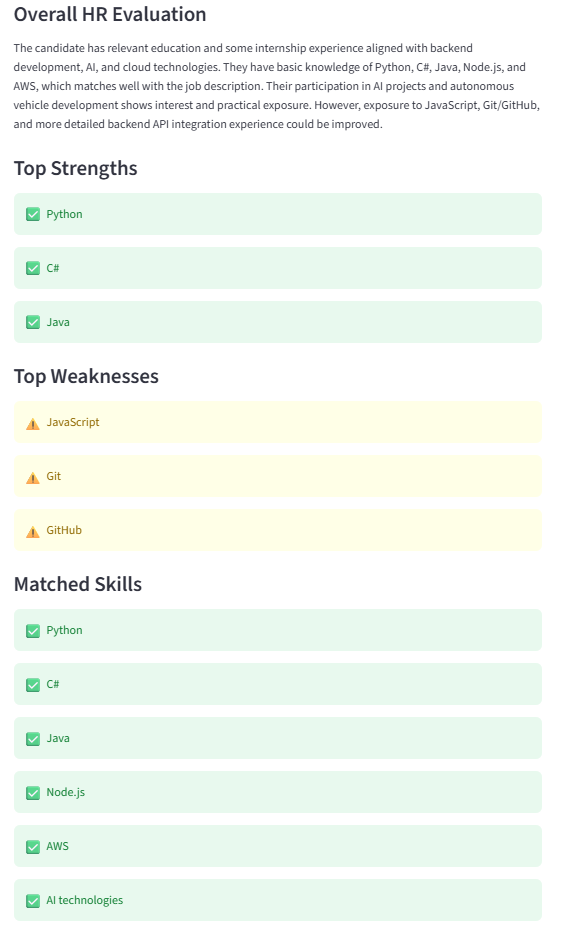
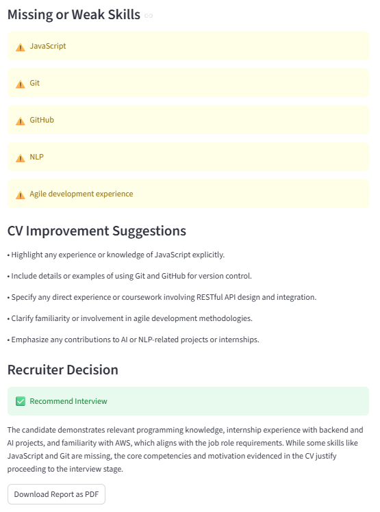

# AI-Powered CV Screening & Job Matching

This project demonstrates how AI can automate CV screening by combining semantic similarity and LLM-based HR evaluation.

## Live Demo
[Click to try the app](https://ai-cv-screening-system.streamlit.app)

## Key Features
- CV and job description matching using AI
- Semantic similarity scoring
- AI-based HR evaluation
- Skill extraction from CV
- Match score visualization
- Recruiter-style decision support
- Downloadable PDF report

## Demo

### Input & Matching


### HR Evaluation


### Final Decision


## Tech Stack
- Python
- Streamlit
- OpenAI API
- NumPy
- PyPDF
- ReportLab

## AI Approach
- OpenAI embeddings are used to convert CV and job descriptions into vectors
- Cosine similarity is used to calculate match score
- LLM is used for HR-style evaluation and decision making


## How It Works
1. Upload a candidate CV (PDF)
2. Paste a job description
3. The system analyzes both using AI
4. Generates:
   - Match score
   - Skill comparison
   - HR evaluation
   - Recruiter decision
5. Option to download a detailed PDF report
## System Architecture

This diagram represents the end-to-end flow of the AI-powered CV screening system.

```
User
|
▼
Upload CV (PDF) + Job Description
|
▼
PDF Text Extraction (PyPDF)
|
▼
Skill Extraction (NLP)
|
▼
OpenAI Embeddings (CV & Job Description)
|
▼
Cosine Similarity Calculation
|
▼
Match Score Generation
|
▼
AI-Based HR Evaluation (LLM)
|
▼
Results Display (Streamlit UI)
|
▼
PDF Report Generation
```

## How to Run

```bash
pip install -r requirements.txt
streamlit run app.py
```

## Project Purpose
This project demonstrates how artificial intelligence can support human resources processes by automating candidate screening and improving recruitment efficiency. It aims to reduce manual effort and provide data-driven insights for better hiring decisions.

## Author
Doğa Akyıldız
